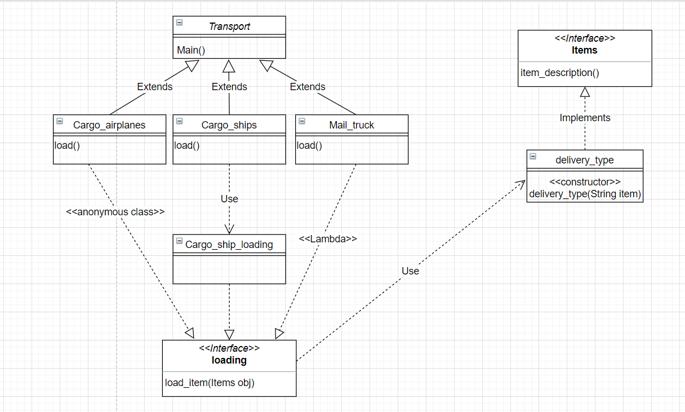
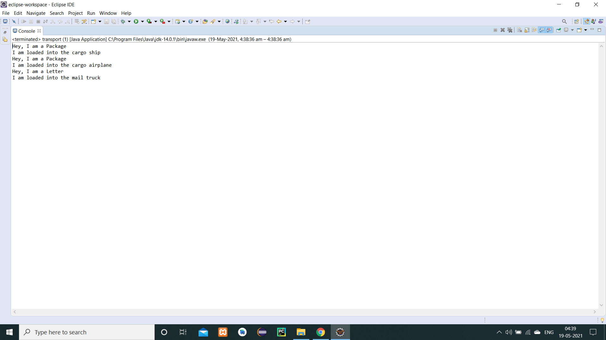

## Problem statement

"Our company manages deliveries, such as letters and packages. Letters contain just text. Packages contain one or multiple items. The items could be anything that can be shipped. 
It must be represented as an interface in the application with a single method that returns the description of the item. These deliveries are transported via cargo ships, cargo 
airplanes, and mail trucks. Each transport vehicle must have a load method that puts a mail item onto it."

 

## Task
1. Design the interfaces and classes above using inheritance, abstract classes, and classes with inheritance.
2. Create a main method in which you create one object for each vehicle type defined above.
3. Call the load method on each.
4. Add an item of a named subclass of Item to the object of the first vehicle type.
5. Add an item using an anonymous class to the object of the second vehicle type.
6. Finally, add an item using a lambda expression to the object of the third vehicle type.

 

## Class diagram

 

## Output

